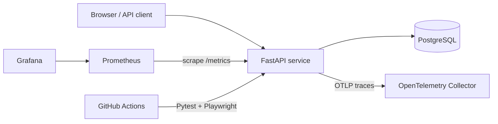

# Service Observability Lab

[](https://github.com/tefik-aliu/service-observability-lab/actions/workflows/ci.yml)

A production-style reliability and observability portfolio project. It combines a FastAPI service, PostgreSQL, Prometheus metrics, Grafana dashboards, OpenTelemetry traces, Docker Compose, Kubernetes manifests, TypeScript Playwright tests and Python API tests.

## Why this project exists

The repository demonstrates how a small service can be designed for operations rather than only for local development: health and readiness probes, structured deployment assets, measurable service behaviour, automated browser/API quality gates and load-test thresholds.

## Architecture



## Features

- FastAPI REST API and interactive dashboard
- PostgreSQL in Docker; SQLite fallback for local tests
- Prometheus request, latency and business metrics
- Provisioned Grafana dashboard
- Optional OpenTelemetry OTLP tracing
- Health and readiness endpoints for orchestration
- Docker health check and non-root runtime user
- Kubernetes Deployment, Service, probes and resource limits
- Python Pytest API suite
- TypeScript Playwright browser and API tests
- k6 load test with latency and error-rate thresholds
- GitHub Actions quality and browser-test pipelines

## Quick start

### Local Python

```bash
python -m venv .venv
source .venv/bin/activate  # Windows: .venv\\Scripts\\activate
pip install -r requirements-dev.txt
uvicorn app.main:app --reload
```

Open `http://localhost:8000`, API docs at `http://localhost:8000/docs`, and metrics at `http://localhost:8000/metrics`.

### Full observability stack

```bash
docker compose up --build
```

- Application: `http://localhost:8000`
- Prometheus: `http://localhost:9090`
- Grafana: `http://localhost:3000` (`admin` / `admin` for local demo only)

## Tests

```bash
pip install -r requirements-dev.txt
pytest
ruff check app tests

npm install
npx playwright install chromium
npm run typecheck
npm run test:e2e
```

## Load testing

```bash
k6 run qa/load/k6.js
```

## Kubernetes

The `k8s/` folder is intentionally provider-neutral. Copy `secret.example.yaml`, replace the example password, and deploy the resources to a test cluster.

```bash
kubectl apply -f k8s/namespace.yaml
kubectl apply -f k8s/configmap.yaml
kubectl apply -f k8s/secret.yaml
kubectl apply -f k8s/postgres.yaml
kubectl apply -f k8s/app.yaml
```

## Technology

Python · FastAPI · SQLAlchemy · PostgreSQL · Prometheus · Grafana · OpenTelemetry · Docker · Kubernetes · TypeScript · Playwright · Pytest · k6 · GitHub Actions

## Portfolio note

This is a learning and portfolio system, not a claim of production operation at scale. Its purpose is to demonstrate practical understanding of reliability, observability, automated testing and cloud-native deployment patterns.
